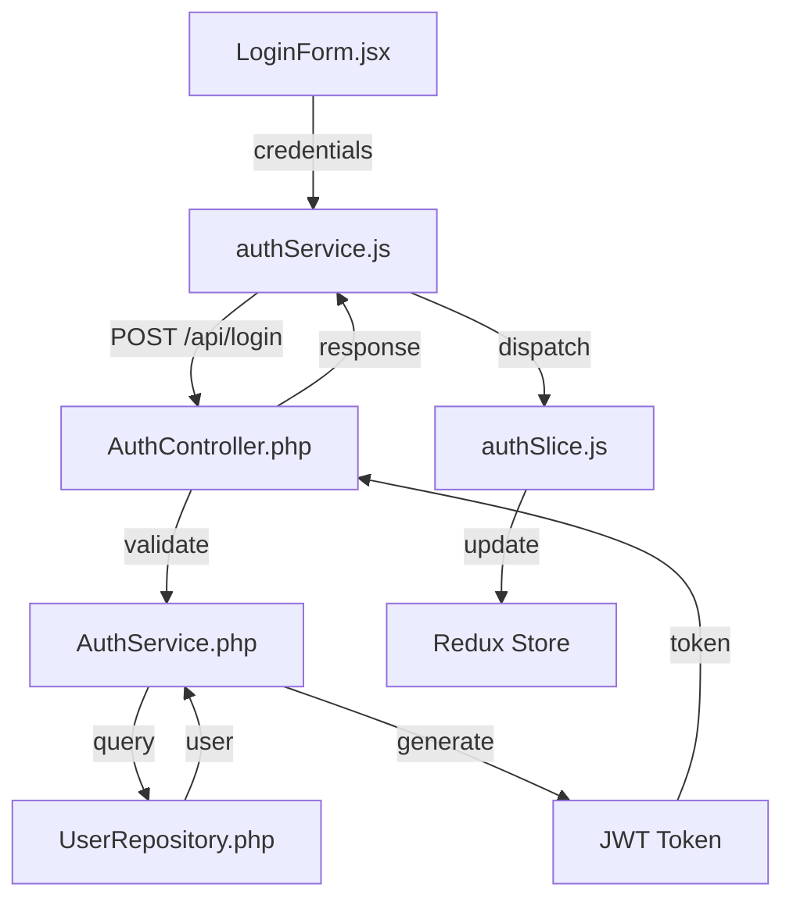
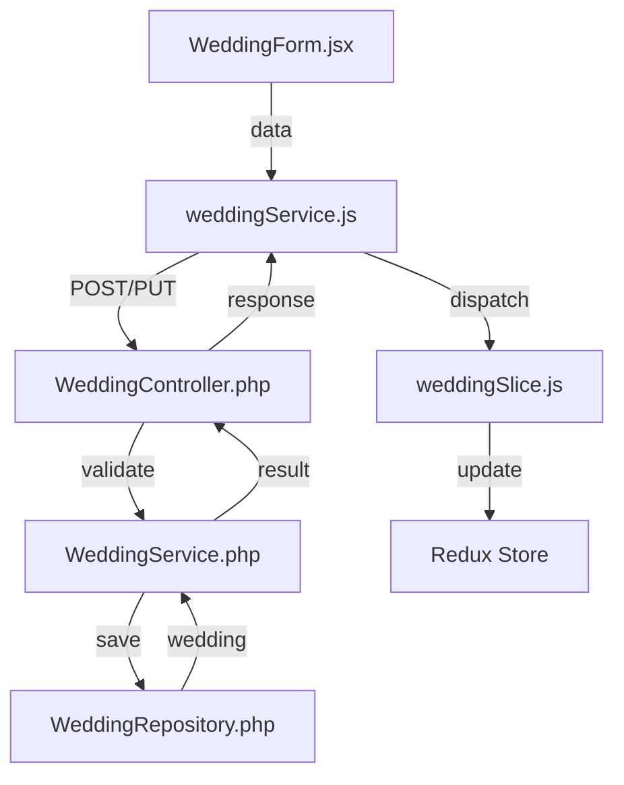
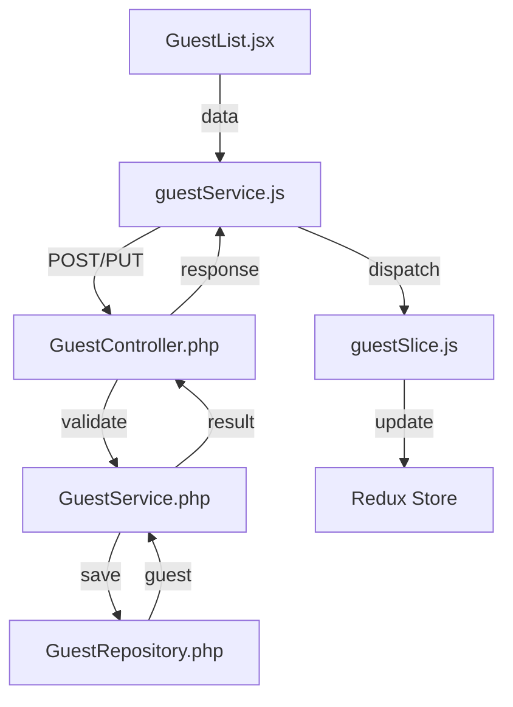
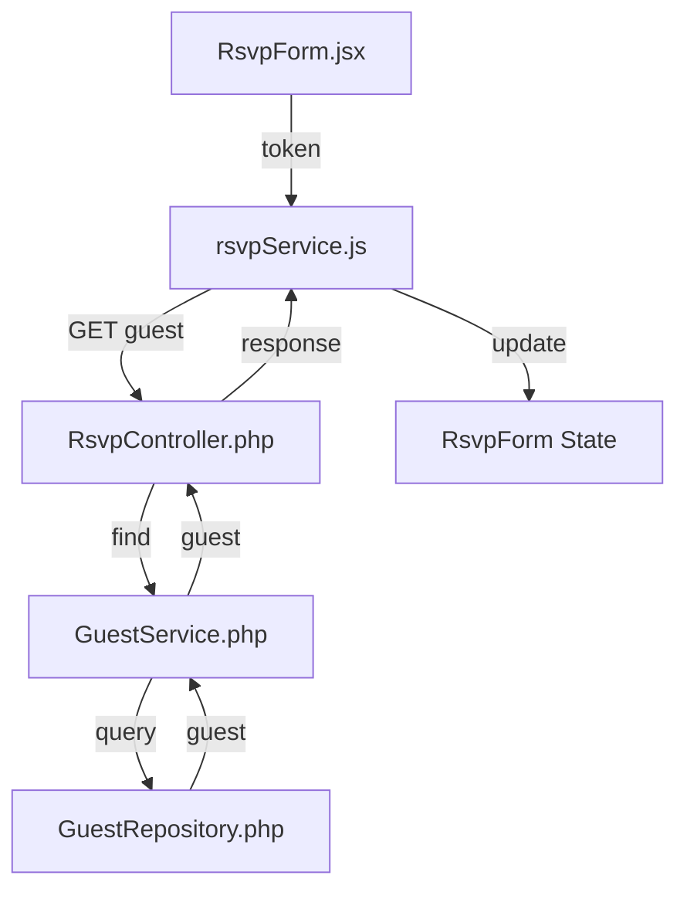
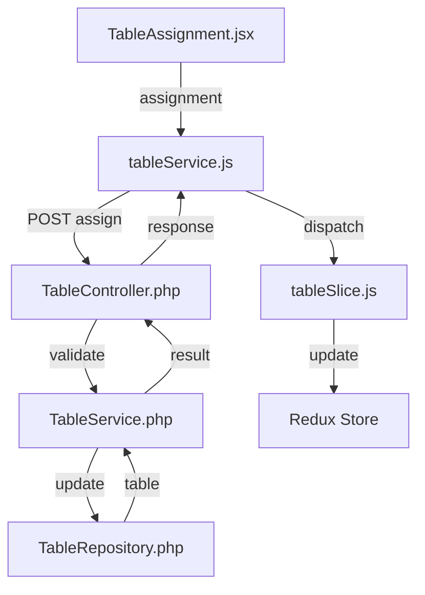
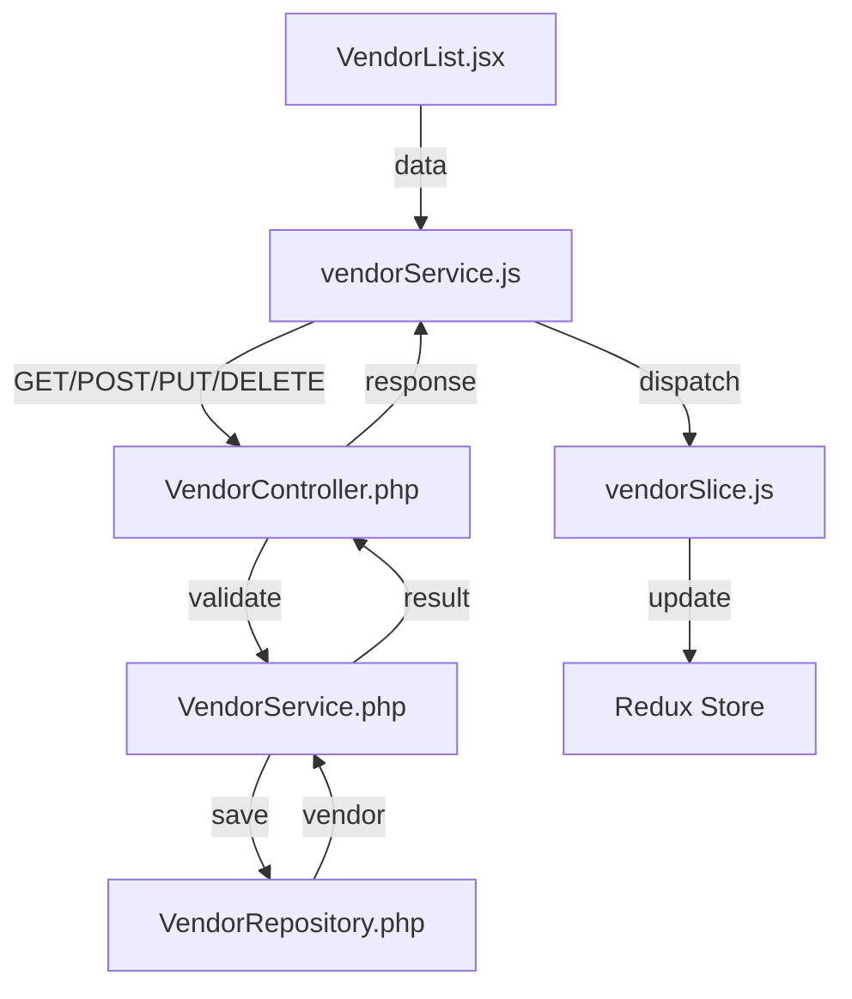
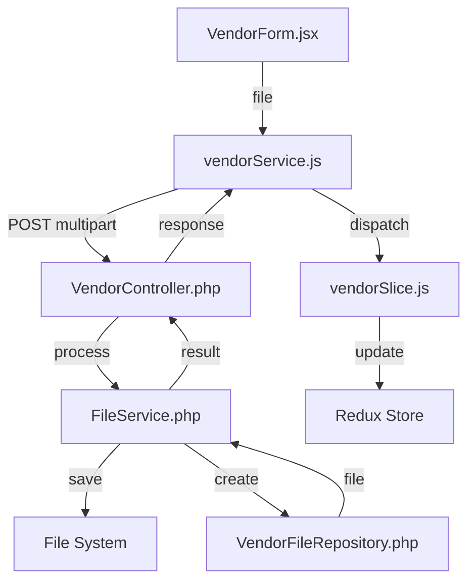

# Communication Patterns and Integration

## Frontend-Backend Communication

### 1. Authentication Flow


### 2. Wedding Management Flow


### 3. Guest Management Flow


### 4. RSVP Flow


### 5. Table Management Flow


### 6. Vendor Management Flow


### 7. File Upload Flow


## State Management Patterns

### 1. Data Loading
```javascript
// Component
useEffect(() => {
    dispatch(fetchData())
        .unwrap()
        .then(handleSuccess)
        .catch(handleError);
}, [dispatch]);

// Slice
const fetchData = createAsyncThunk(
    'slice/fetchData',
    async (_, { rejectWithValue }) => {
        try {
            const response = await service.getData();
            return response.data;
        } catch (error) {
            return rejectWithValue(error.response?.data);
        }
    }
);
```

### 2. Form Submission
```javascript
// Component
const handleSubmit = async (data) => {
    try {
        await dispatch(submitData(data)).unwrap();
        handleSuccess();
    } catch (error) {
        handleError(error);
    }
};

// Slice
const submitData = createAsyncThunk(
    'slice/submitData',
    async (data, { rejectWithValue }) => {
        try {
            const response = await service.submit(data);
            return response.data;
        } catch (error) {
            return rejectWithValue(error.response?.data);
        }
    }
);
```

### 3. Real-time Updates
```javascript
// Component
useEffect(() => {
    const subscription = websocket.subscribe(
        channel,
        (data) => dispatch(updateData(data))
    );
    return () => subscription.unsubscribe();
}, [dispatch]);

// Slice
const updateData = createAction('slice/updateData');
```

## Error Handling Patterns

### 1. API Error Handling
```javascript
// Service Layer
try {
    const response = await api.request({
        method,
        url,
        data,
        validateStatus: (status) => status < 500
    });
    return response.data;
} catch (error) {
    if (error.response) {
        // Handle specific error responses
        switch (error.response.status) {
            case 400:
                throw new ValidationError(error.response.data);
            case 401:
                throw new AuthenticationError();
            case 403:
                throw new AuthorizationError();
            case 404:
                throw new NotFoundError();
            default:
                throw new ApiError(error.response.data);
        }
    }
    throw new NetworkError();
}
```

### 2. Component Error Handling
```javascript
// Component
const [error, setError] = useState(null);

const handleSubmit = async (data) => {
    try {
        await dispatch(submitData(data)).unwrap();
        handleSuccess();
    } catch (error) {
        if (error instanceof ValidationError) {
            setFormErrors(error.details);
        } else if (error instanceof AuthenticationError) {
            navigate('/login');
        } else {
            setError(error.message);
        }
    }
};
```

### 3. Global Error Handling
```javascript
// Error Boundary
class ErrorBoundary extends React.Component {
    state = { error: null };

    static getDerivedStateFromError(error) {
        return { error };
    }

    componentDidCatch(error, errorInfo) {
        logError(error, errorInfo);
    }

    render() {
        if (this.state.error) {
            return <ErrorDisplay error={this.state.error} />;
        }
        return this.props.children;
    }
}
```

## Integration Points

### 1. Authentication Integration
- Frontend: `authService.js`, `authSlice.js`
- Backend: `AuthController.php`, `AuthService.php`
- Communication: JWT tokens
- Storage: LocalStorage, Redux store

### 2. Form Management Integration
- Frontend: `useForm.js`, form components
- Backend: Validation constraints
- Communication: Validation errors
- Storage: Component state, Redux store

### 3. File Upload Integration
- Frontend: `FileUpload.jsx`, `fileService.js`
- Backend: `FileController.php`, `FileService.php`
- Communication: Multipart form data
- Storage: File system, database references

### 4. Notification Integration
- Frontend: `NotificationCenter.jsx`, `notificationService.js`
- Backend: `NotificationController.php`, WebSocket server
- Communication: WebSocket, REST API
- Storage: Redux store, database

### 5. Vendor Management Integration
- Frontend: `vendorService.js`, `vendorSlice.js`
- Backend: `VendorController.php`, `VendorService.php`
- Communication: REST API, Multipart form data
- Storage: File system, database

### 6. File Management Integration
- Frontend: `VendorForm.jsx`, `vendorService.js`
- Backend: `VendorController.php`, `FileService.php`
- Communication: Multipart form data
- Storage: File system, database references

## Testing Integration

### 1. Frontend Testing
```javascript
// Component Tests
describe('Component', () => {
    it('handles successful submission', async () => {
        const mockDispatch = jest.fn();
        const { result } = renderHook(() => useDispatch());
        result.current = mockDispatch;

        const { getByRole } = render(<Component />);
        await userEvent.click(getByRole('button'));

        expect(mockDispatch).toHaveBeenCalledWith(
            expect.objectContaining({
                type: 'slice/submit'
            })
        );
    });
});

// Service Tests
describe('Service', () => {
    it('handles API errors', async () => {
        const mockError = new Error('API Error');
        api.request.mockRejectedValue(mockError);

        await expect(service.submit(data))
            .rejects
            .toThrow('API Error');
    });
});
```

### 2. Backend Testing
```php
// Controller Tests
public function testSubmission(): void
{
    $client = static::createClient();
    $response = $client->request('POST', '/api/endpoint', [
        'json' => $data
    ]);

    $this->assertResponseIsSuccessful();
    $this->assertJsonContains(['status' => 'success']);
}

// Service Tests
public function testValidation(): void
{
    $this->expectException(ValidationException::class);
    $service->process($invalidData);
}
```

This documentation provides:
1. Detailed communication flows
2. State management patterns
3. Error handling strategies
4. Integration points
5. Testing approaches 