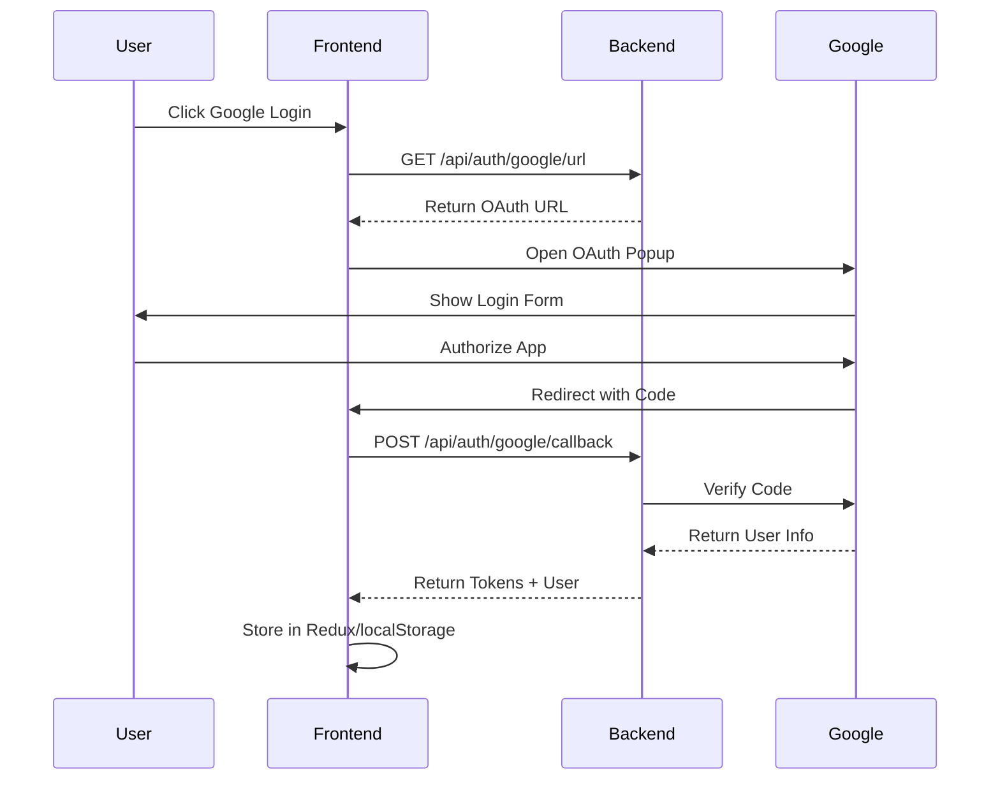
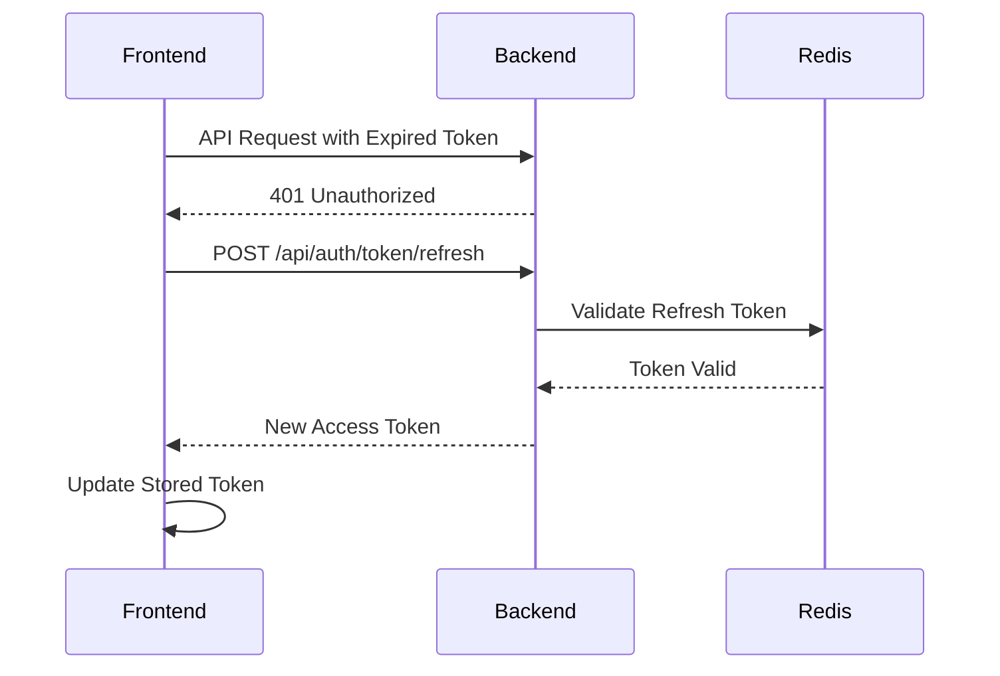
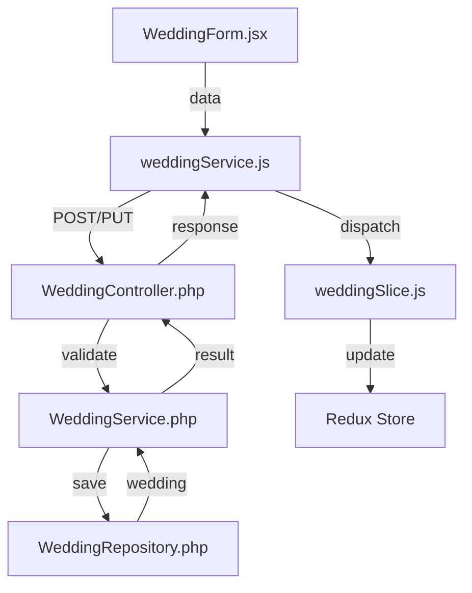
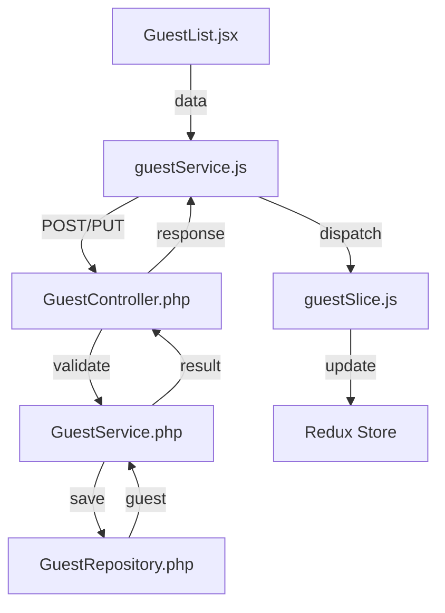
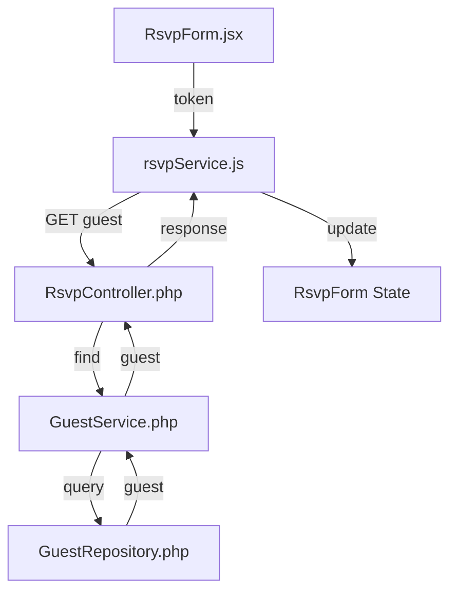
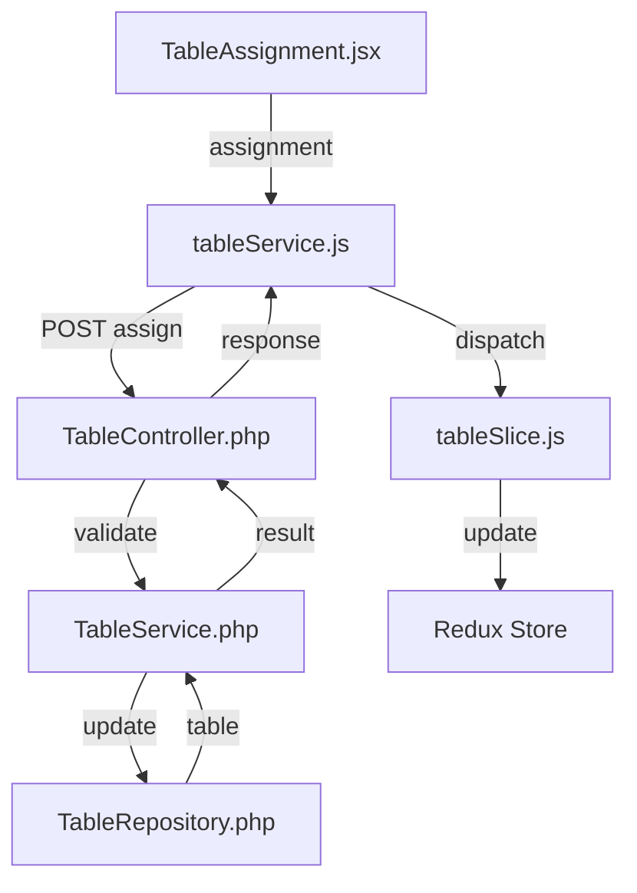
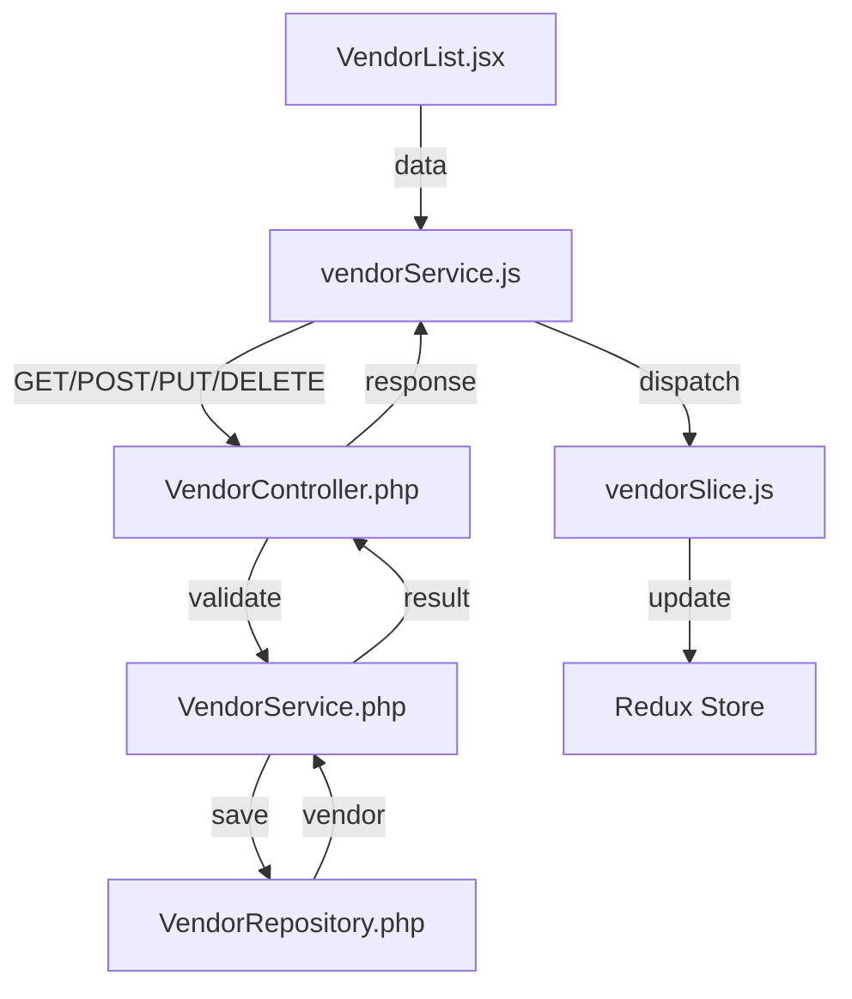
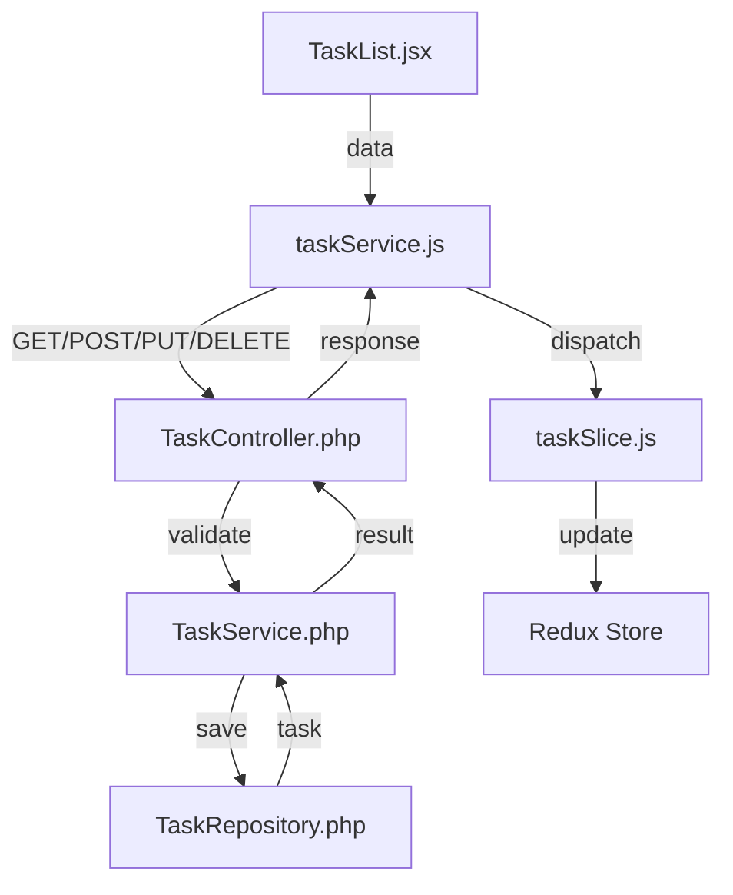
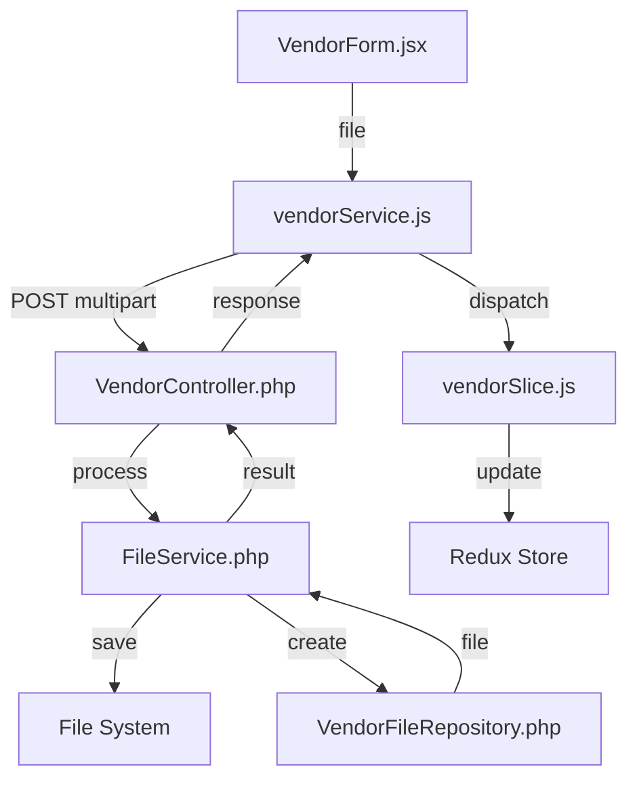

# Communication Patterns and Integration

## Frontend-Backend Communication

### 1. Authentication Flow

### Google OAuth Integration

#### Flow Overview
1. User clicks "Continue with Google" button
2. Frontend fetches OAuth URL from backend
3. OAuth popup opens with Google login
4. User authorizes application
5. Google redirects to callback page
6. Callback page sends code to parent window
7. Parent window exchanges code for tokens
8. User data and tokens stored in Redux/localStorage

#### Component Communication


### Token Management

#### Token Flow
1. Access token stored in localStorage
2. Token added to API requests
3. Token refresh on expiration
4. Refresh token stored securely
5. Automatic token refresh flow

#### Token Refresh Flow


### User Avatar Handling

#### Avatar Flow
1. Avatar URL received from Google
2. URL stored in user entity
3. Avatar component displays image
4. Fallback to initials if no avatar
5. Real-time updates on profile changes

#### Component Integration
```javascript
// Frontend Components
const UserAvatar = () => {
    const user = useSelector(state => state.auth.user);
    return (
        <Avatar
            src={user.avatar}
            fallback={getInitials(user)}
        />
    );
};

// Backend Response
{
    "user": {
        "id": 1,
        "email": "user@example.com",
        "firstName": "John",
        "lastName": "Doe",
        "avatar": "https://lh3.googleusercontent.com/..."
    }
}
```

### Error Handling

#### OAuth Errors
1. Invalid client configuration
2. User cancels authorization
3. Token exchange failures
4. Network connectivity issues
5. Invalid callback handling

#### Error Responses
```javascript
// Frontend Error Handling
try {
    await handleGoogleLogin(code);
} catch (error) {
    if (error.response?.status === 401) {
        // Handle unauthorized
    } else if (error.message === 'popup_closed') {
        // Handle user cancelled
    } else {
        // Handle other errors
    }
}

// Backend Error Responses
{
    "error": "invalid_grant",
    "message": "Invalid authorization code"
}
```

### Testing Considerations

#### Frontend Tests
1. OAuth button functionality
2. Popup handling
3. Token management
4. Avatar display
5. Error scenarios

#### Backend Tests
1. OAuth URL generation
2. Token exchange
3. User creation/update
4. Token refresh
5. Error handling

#### Integration Tests
1. Complete OAuth flow
2. Token refresh flow
3. Avatar updates
4. Error scenarios
5. Security validations

### 2. Wedding Management Flow


### 3. Guest Management Flow


### 4. RSVP Flow


### 5. Table Management Flow


### 6. Vendor Management Flow


### 7. Task Management Flow


### 8. File Upload Flow


## State Management Patterns

### 1. Data Loading
```javascript
// Component
useEffect(() => {
    dispatch(fetchData())
        .unwrap()
        .then(handleSuccess)
        .catch(handleError);
}, [dispatch]);

// Slice
const fetchData = createAsyncThunk(
    'slice/fetchData',
    async (_, { rejectWithValue }) => {
        try {
            const response = await service.getData();
            return response.data;
        } catch (error) {
            return rejectWithValue(error.response?.data);
        }
    }
);
```

### 2. Form Submission
```javascript
// Component
const handleSubmit = async (data) => {
    try {
        await dispatch(submitData(data)).unwrap();
        handleSuccess();
    } catch (error) {
        handleError(error);
    }
};

// Slice
const submitData = createAsyncThunk(
    'slice/submitData',
    async (data, { rejectWithValue }) => {
        try {
            const response = await service.submit(data);
            return response.data;
        } catch (error) {
            return rejectWithValue(error.response?.data);
        }
    }
);
```

### 3. Real-time Updates
```javascript
// Component
useEffect(() => {
    const subscription = websocket.subscribe(
        channel,
        (data) => dispatch(updateData(data))
    );
    return () => subscription.unsubscribe();
}, [dispatch]);

// Slice
const updateData = createAction('slice/updateData');
```

### 4. Task Management Patterns
```javascript
// Task List with Filtering and Sorting
const TaskList = () => {
    const [filters, setFilters] = useState({
        category: null,
        status: null,
        priority: null
    });
    
    const tasks = useSelector(state => 
        selectFilteredTasks(state.tasks.items, filters)
    );

    const handleDragEnd = async (result) => {
        if (!result.destination) return;
        
        const newOrder = reorder(
            tasks,
            result.source.index,
            result.destination.index
        );
        
        await dispatch(reorderTasks(newOrder.map((task, index) => ({
            id: task.id,
            order: index
        }))));
    };

    return (
        <DragDropContext onDragEnd={handleDragEnd}>
            <TaskFilters filters={filters} onChange={setFilters} />
            <Droppable droppableId="tasks">
                {(provided) => (
                    <div ref={provided.innerRef} {...provided.droppableProps}>
                        {tasks.map((task, index) => (
                            <Draggable key={task.id} draggableId={task.id} index={index}>
                                {(provided) => (
                                    <TaskItem
                                        task={task}
                                        ref={provided.innerRef}
                                        {...provided.draggableProps}
                                        {...provided.dragHandleProps}
                                    />
                                )}
                            </Draggable>
                        ))}
                        {provided.placeholder}
                    </div>
                )}
            </Droppable>
        </DragDropContext>
    );
};

// Task Slice
const taskSlice = createSlice({
    name: 'tasks',
    initialState: {
        items: [],
        loading: false,
        error: null
    },
    reducers: {
        reorderTasks: (state, action) => {
            const newOrder = action.payload;
            state.items = newOrder.map(order => ({
                ...state.items.find(task => task.id === order.id),
                displayOrder: order.order
            }));
        }
    },
    extraReducers: (builder) => {
        builder
            .addCase(fetchTasks.pending, (state) => {
                state.loading = true;
            })
            .addCase(fetchTasks.fulfilled, (state, action) => {
                state.items = action.payload;
                state.loading = false;
            })
            .addCase(fetchTasks.rejected, (state, action) => {
                state.error = action.payload;
                state.loading = false;
            });
    }
});
```

## Error Handling Patterns

### 1. API Error Handling
```javascript
// Service Layer
try {
    const response = await api.request({
        method,
        url,
        data,
        validateStatus: (status) => status < 500
    });
    return response.data;
} catch (error) {
    if (error.response) {
        // Handle specific error responses
        switch (error.response.status) {
            case 400:
                throw new ValidationError(error.response.data);
            case 401:
                throw new AuthenticationError();
            case 403:
                throw new AuthorizationError();
            case 404:
                throw new NotFoundError();
            default:
                throw new ApiError(error.response.data);
        }
    }
    throw new NetworkError();
}
```

### 2. Component Error Handling
```javascript
// Component
const [error, setError] = useState(null);

const handleSubmit = async (data) => {
    try {
        await dispatch(submitData(data)).unwrap();
        handleSuccess();
    } catch (error) {
        if (error instanceof ValidationError) {
            setFormErrors(error.details);
        } else if (error instanceof AuthenticationError) {
            navigate('/login');
        } else {
            setError(error.message);
        }
    }
};
```

### 3. Global Error Handling
```javascript
// Error Boundary
class ErrorBoundary extends React.Component {
    state = { error: null };

    static getDerivedStateFromError(error) {
        return { error };
    }

    componentDidCatch(error, errorInfo) {
        logError(error, errorInfo);
    }

    render() {
        if (this.state.error) {
            return <ErrorDisplay error={this.state.error} />;
        }
        return this.props.children;
    }
}
```

## Integration Points

### 1. Authentication Integration
- Frontend: `authService.js`, `authSlice.js`
- Backend: `AuthController.php`, `AuthService.php`
- Communication: JWT tokens
- Storage: LocalStorage, Redux store

### 2. Form Management Integration
- Frontend: `useForm.js`, form components
- Backend: Validation constraints
- Communication: Validation errors
- Storage: Component state, Redux store

### 3. File Upload Integration
- Frontend: `FileUpload.jsx`, `fileService.js`
- Backend: `FileController.php`, `FileService.php`
- Communication: Multipart form data
- Storage: File system, database references

### 4. Notification Integration
- Frontend: `NotificationCenter.jsx`, `notificationService.js`
- Backend: `NotificationController.php`, WebSocket server
- Communication: WebSocket, REST API
- Storage: Redux store, database

### 5. Vendor Management Integration
- Frontend: `vendorService.js`, `vendorSlice.js`
- Backend: `VendorController.php`, `VendorService.php`
- Communication: REST API, Multipart form data
- Storage: File system, database

### 6. File Management Integration
- Frontend: `VendorForm.jsx`, `vendorService.js`
- Backend: `VendorController.php`, `FileService.php`
- Communication: Multipart form data
- Storage: File system, database references

## Testing Integration

### 1. Frontend Testing
```javascript
// Component Tests
describe('Component', () => {
    it('handles successful submission', async () => {
        const mockDispatch = jest.fn();
        const { result } = renderHook(() => useDispatch());
        result.current = mockDispatch;

        const { getByRole } = render(<Component />);
        await userEvent.click(getByRole('button'));

        expect(mockDispatch).toHaveBeenCalledWith(
            expect.objectContaining({
                type: 'slice/submit'
            })
        );
    });
});

// Service Tests
describe('Service', () => {
    it('handles API errors', async () => {
        const mockError = new Error('API Error');
        api.request.mockRejectedValue(mockError);

        await expect(service.submit(data))
            .rejects
            .toThrow('API Error');
    });
});
```

### 2. Backend Testing
```php
// Controller Tests
public function testSubmission(): void
{
    $client = static::createClient();
    $response = $client->request('POST', '/api/endpoint', [
        'json' => $data
    ]);

    $this->assertResponseIsSuccessful();
    $this->assertJsonContains(['status' => 'success']);
}

// Service Tests
public function testValidation(): void
{
    $this->expectException(ValidationException::class);
    $service->process($invalidData);
}
```

# Integration and Testing

## Budget Management Integration

### Frontend-Backend Integration

#### Budget API Integration
```javascript
// Budget service configuration
const budgetService = {
  getBudget: async (weddingId) => {
    return await api.get(`/weddings/${weddingId}/budget`);
  },
  createBudget: async (weddingId, data) => {
    return await api.post(`/weddings/${weddingId}/budget`, data);
  },
  updateBudget: async (weddingId, data) => {
    return await api.put(`/weddings/${weddingId}/budget`, data);
  }
};

// Expense service configuration
const expenseService = {
  getExpenses: async (weddingId) => {
    return await api.get(`/weddings/${weddingId}/expenses`);
  },
  createExpense: async (weddingId, data) => {
    return await api.post(`/weddings/${weddingId}/expenses`, data);
  },
  updateExpense: async (weddingId, expenseId, data) => {
    return await api.put(`/weddings/${weddingId}/expenses/${expenseId}`, data);
  },
  deleteExpense: async (weddingId, expenseId) => {
    return await api.delete(`/weddings/${weddingId}/expenses/${expenseId}`);
  }
};
```

#### Vendor-Budget Integration
```javascript
// Vendor service with budget integration
const vendorService = {
  createVendor: async (weddingId, data) => {
    const response = await api.post(`/weddings/${weddingId}/vendors`, data);
    // Refresh budget data after vendor creation
    await budgetService.getBudget(weddingId);
    return response;
  },
  updateVendor: async (weddingId, vendorId, data) => {
    const response = await api.put(`/weddings/${weddingId}/vendors/${vendorId}`, data);
    // Refresh budget data after vendor update
    await budgetService.getBudget(weddingId);
    return response;
  }
};
```

### Testing

#### Budget Component Tests
```javascript
describe('Budget Component', () => {
  it('should display budget overview when budget exists', async () => {
    const mockBudget = {
      totalAmount: 50000,
      categoryAllocations: {
        venue: 20000,
        catering: 15000,
        photography: 10000,
        other: 5000
      }
    };
    
    render(<Budget wedding={mockWedding} />);
    
    expect(screen.getByText('Budget Overview')).toBeInTheDocument();
    expect(screen.getByText('$50,000')).toBeInTheDocument();
  });

  it('should handle empty budget state', async () => {
    render(<Budget wedding={mockWedding} />);
    
    expect(screen.getByText('No budget set')).toBeInTheDocument();
    expect(screen.getByText('Set Budget')).toBeInTheDocument();
  });
});
```

#### Expense Management Tests
```javascript
describe('Expense Management', () => {
  it('should create new expense', async () => {
    const mockExpense = {
      category: 'venue',
      description: 'Venue deposit',
      amount: 5000,
      status: 'paid'
    };
    
    render(<ExpenseForm wedding={mockWedding} />);
    
    fireEvent.change(screen.getByLabelText('Category'), {
      target: { value: 'venue' }
    });
    fireEvent.change(screen.getByLabelText('Amount'), {
      target: { value: '5000' }
    });
    
    fireEvent.click(screen.getByText('Save'));
    
    await waitFor(() => {
      expect(screen.getByText('Expense created successfully')).toBeInTheDocument();
    });
  });

  it('should update expense status', async () => {
    render(<ExpenseList wedding={mockWedding} />);
    
    fireEvent.click(screen.getByText('Mark as Paid'));
    
    await waitFor(() => {
      expect(screen.getByText('Paid')).toBeInTheDocument();
    });
  });
});
```

#### Vendor Integration Tests
```javascript
describe('Vendor Budget Integration', () => {
  it('should create expenses when vendor is created', async () => {
    const mockVendor = {
      name: 'Test Vendor',
      type: 'photographer',
      price: 5000,
      depositAmount: 1000,
      depositPaid: true
    };
    
    render(<VendorForm wedding={mockWedding} />);
    
    // Fill vendor form
    fireEvent.change(screen.getByLabelText('Name'), {
      target: { value: mockVendor.name }
    });
    fireEvent.change(screen.getByLabelText('Price'), {
      target: { value: mockVendor.price }
    });
    
    fireEvent.click(screen.getByText('Save'));
    
    await waitFor(() => {
      // Check if expenses were created
      expect(screen.getByText('Deposit for Test Vendor')).toBeInTheDocument();
      expect(screen.getByText('Remaining balance for Test Vendor')).toBeInTheDocument();
    });
  });
});
```

### Error Handling

#### Budget Error Handling
```javascript
// Budget slice error handling
const budgetSlice = createSlice({
  name: 'budget',
  initialState,
  reducers: {
    setError: (state, action) => {
      state.error = action.payload;
      state.loading = false;
    },
    clearError: (state) => {
      state.error = null;
    }
  },
  extraReducers: (builder) => {
    builder
      .addCase(fetchBudget.rejected, (state, action) => {
        state.error = action.error.message;
        state.loading = false;
      })
      .addCase(createExpense.rejected, (state, action) => {
        state.error = action.error.message;
        state.loading = false;
      });
  }
});
```

#### Expense Error Handling
```javascript
// Expense form error handling
const ExpenseForm = ({ wedding }) => {
  const [error, setError] = useState(null);
  
  const handleSubmit = async (data) => {
    try {
      await expenseService.createExpense(wedding.id, data);
    } catch (err) {
      setError(err.response?.data?.message || 'Failed to create expense');
    }
  };
  
  return (
    <form onSubmit={handleSubmit}>
      {error && <Alert severity="error">{error}</Alert>}
      {/* Form fields */}
    </form>
  );
};
```

### Data Flow

#### Budget Update Flow
```javascript
// Budget update process
const updateBudgetFlow = async (weddingId, budgetData) => {
  // 1. Update budget
  await budgetService.updateBudget(weddingId, budgetData);
  
  // 2. Refresh budget data
  const budgetResponse = await budgetService.getBudget(weddingId);
  
  // 3. Refresh expenses
  const expensesResponse = await expenseService.getExpenses(weddingId);
  
  // 4. Update Redux store
  dispatch(setBudget(budgetResponse.data));
  dispatch(setExpenses(expensesResponse.data));
};
```

#### Vendor-Budget Sync Flow
```javascript
// Vendor-Budget synchronization
const syncVendorBudget = async (weddingId, vendorId) => {
  // 1. Get vendor details
  const vendorResponse = await vendorService.getVendor(weddingId, vendorId);
  const vendor = vendorResponse.data;
  
  // 2. Update or create vendor expenses
  if (vendor.price) {
    // Handle deposit
    if (vendor.depositAmount) {
      await expenseService.createExpense(weddingId, {
        category: vendor.type,
        description: `Deposit for ${vendor.name}`,
        amount: vendor.depositAmount,
        status: vendor.depositPaid ? 'paid' : 'pending',
        isVendorExpense: true,
        vendor: vendor.id
      });
    }
    
    // Handle remaining balance
    const remainingBalance = vendor.price - (vendor.depositAmount || 0);
    if (remainingBalance > 0) {
      await expenseService.createExpense(weddingId, {
        category: vendor.type,
        description: `Remaining balance for ${vendor.name}`,
        amount: remainingBalance,
        status: 'pending',
        isVendorExpense: true,
        vendor: vendor.id
      });
    }
  }
  
  // 3. Refresh budget data
  await updateBudgetFlow(weddingId);
};
```

This documentation provides:
1. Detailed communication flows
2. State management patterns
3. Error handling strategies
4. Integration points
5. Testing approaches 