# Communication Patterns and Integration

This document outlines the integration patterns and communication flows between frontend and backend components of the Wedding Planner application. It serves as the primary reference for:
- Authentication and authorization flows
- Component communication patterns
- Data flow diagrams
- Error handling strategies
- Testing considerations

## Frontend-Backend Communication

### 1. Authentication Flow [✓]

### Google OAuth Integration [✓]

#### Flow Overview
1. User clicks "Continue with Google" button
2. Frontend fetches OAuth URL from backend
3. OAuth popup opens with Google login
4. User authorizes application
5. Google redirects to callback page
6. Callback page sends code to parent window
7. Parent window exchanges code for tokens
8. User data and tokens stored in Redux/localStorage

#### Component Communication
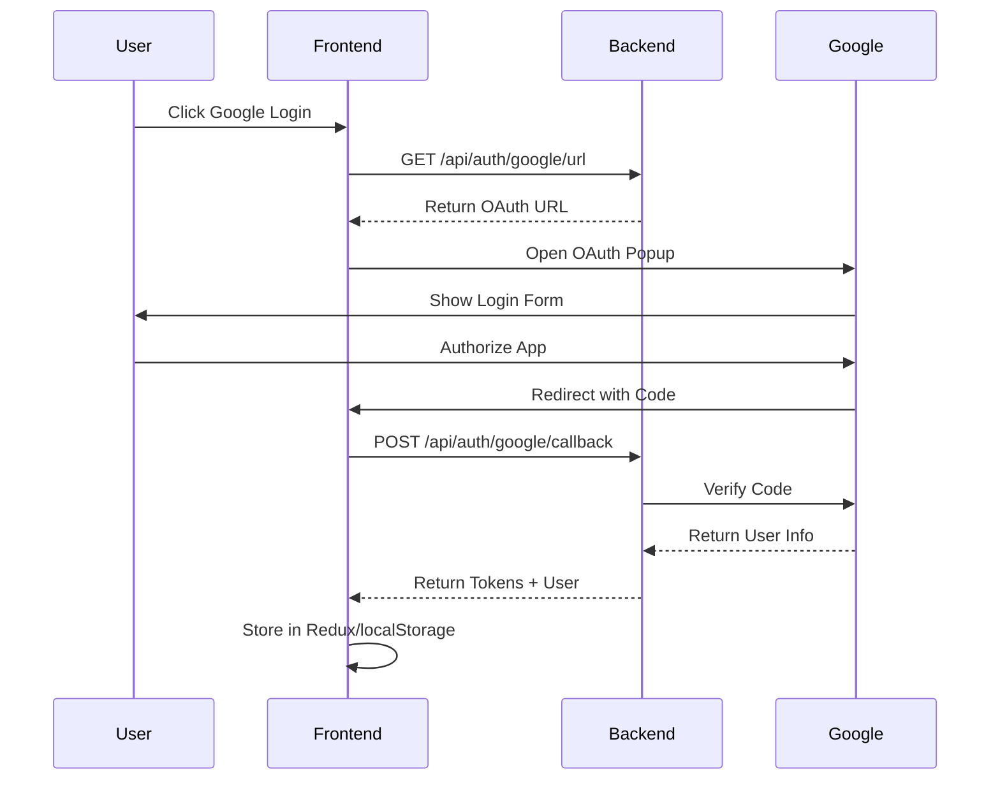

### Token Management [✓]

#### Token Flow
1. Access token stored in localStorage
2. Token added to API requests
3. Token refresh on expiration
4. Refresh token stored securely
5. Automatic token refresh flow

#### Token Refresh Flow
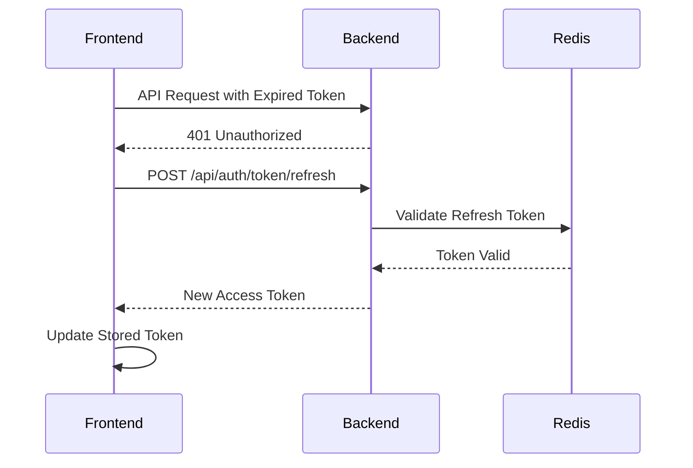

### User Avatar Handling [✓]

#### Avatar Flow
1. Avatar URL received from Google
2. URL stored in user entity
3. Avatar component displays image
4. Fallback to initials if no avatar
5. Real-time updates on profile changes

#### Component Integration
```javascript
// Frontend Components
const UserAvatar = () => {
    const user = useSelector(state => state.auth.user);
    return (
        <Avatar
            src={user.avatar}
            fallback={getInitials(user)}
        />
    );
};

// Backend Response
{
    "user": {
        "id": 1,
        "email": "user@example.com",
        "firstName": "John",
        "lastName": "Doe",
        "avatar": "https://lh3.googleusercontent.com/..."
    }
}
```

### Error Handling [✓]

#### OAuth Errors
1. Invalid client configuration
2. User cancels authorization
3. Token exchange failures
4. Network connectivity issues
5. Invalid callback handling

#### Error Responses
```javascript
// Frontend Error Handling
try {
    await handleGoogleLogin(code);
} catch (error) {
    if (error.response?.status === 401) {
        // Handle unauthorized
    } else if (error.message === 'popup_closed') {
        // Handle user cancelled
    } else {
        // Handle other errors
    }
}

// Backend Error Responses
{
    "error": "invalid_grant",
    "message": "Invalid authorization code"
}
```

### Testing Considerations [✓]

#### Frontend Tests
1. OAuth button functionality
2. Popup handling
3. Token management
4. Avatar display
5. Error scenarios

#### Backend Tests
1. OAuth URL generation
2. Token exchange
3. User creation/update
4. Token refresh
5. Error handling

#### Integration Tests
1. Complete OAuth flow
2. Token refresh flow
3. Avatar updates
4. Error scenarios
5. Security validations

### 2. Wedding Management Flow [✓]
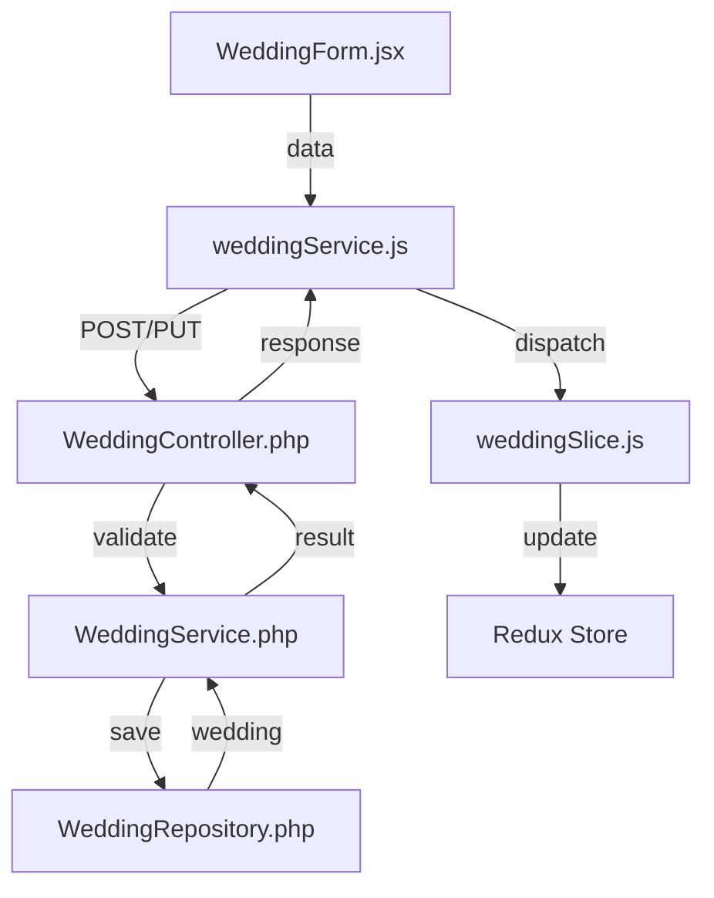

### 3. Guest Management Flow [✓]
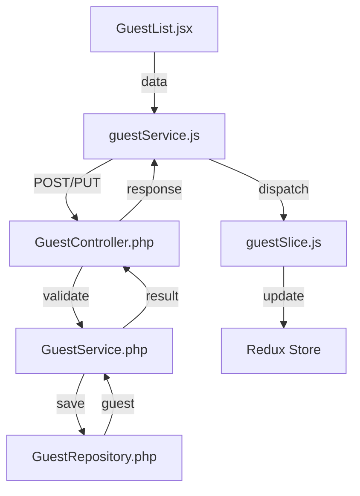

### 4. RSVP Flow [✓]
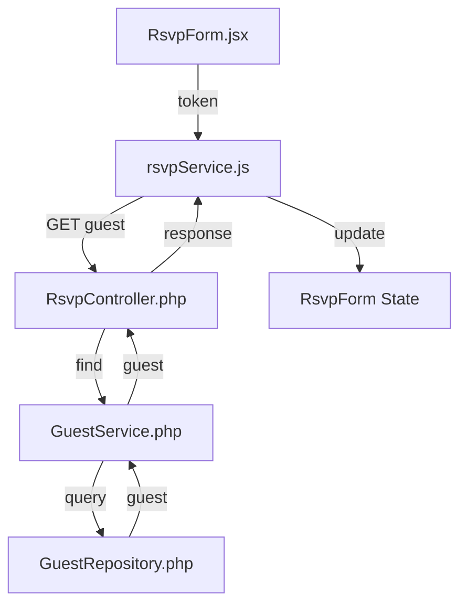

### 5. Table Management Flow [✓]
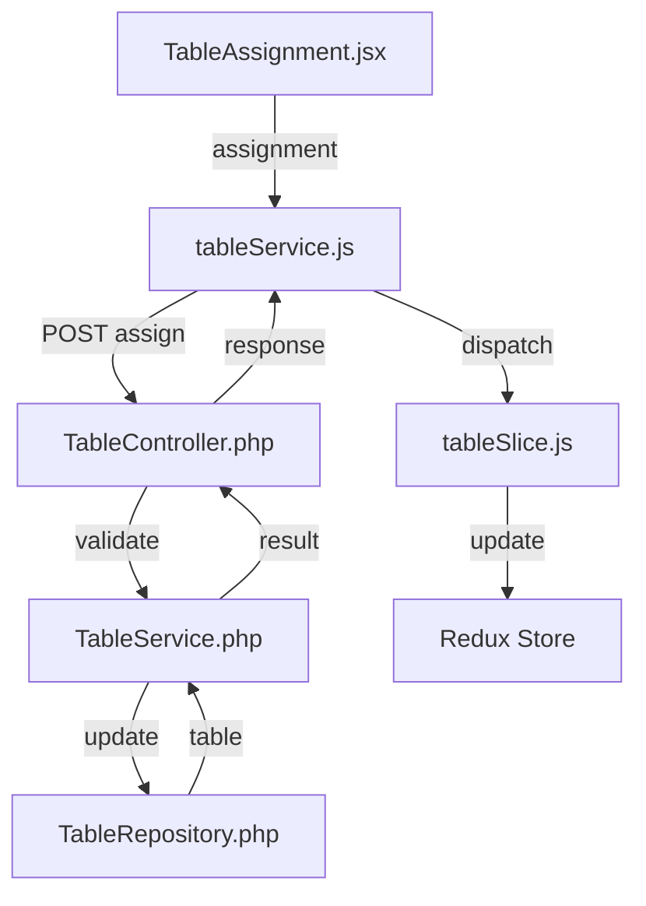

### 6. Vendor Management Flow [✓]
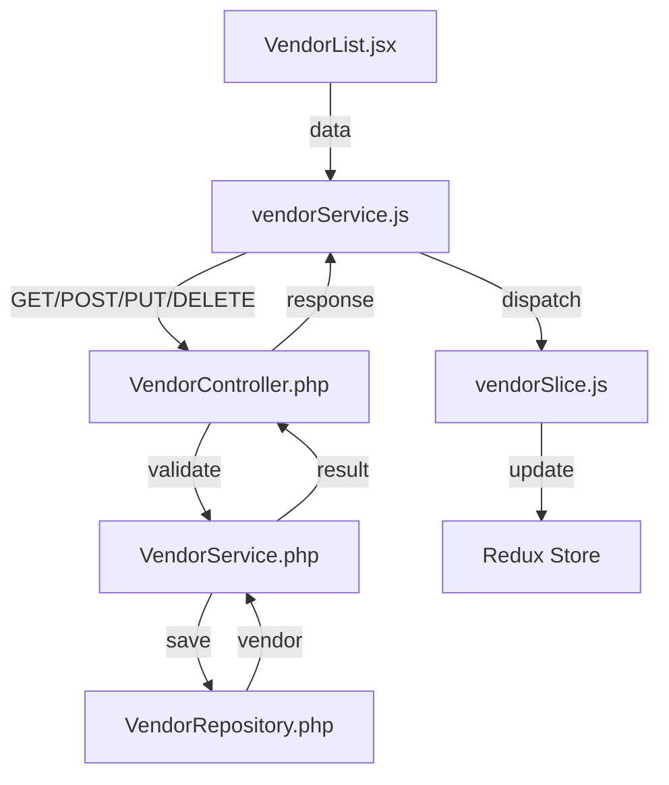

### 7. Task Management Flow [✓]
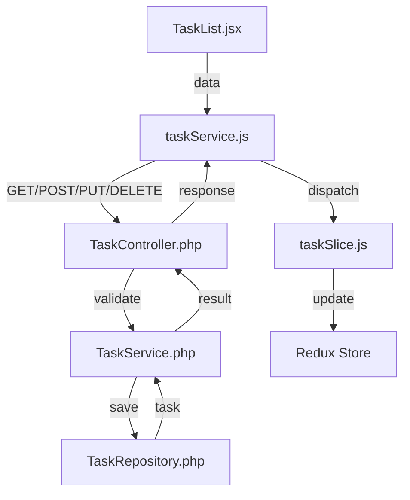

### 8. File Upload Flow [✓]
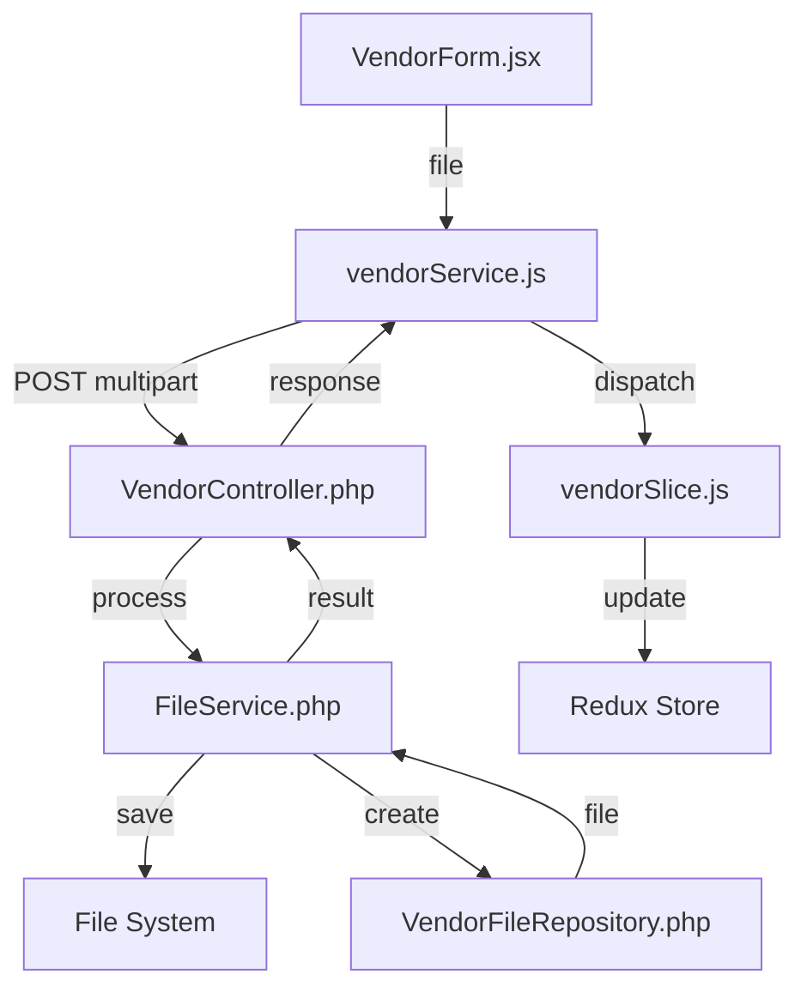

### 9. Budget Management Flow [✓]
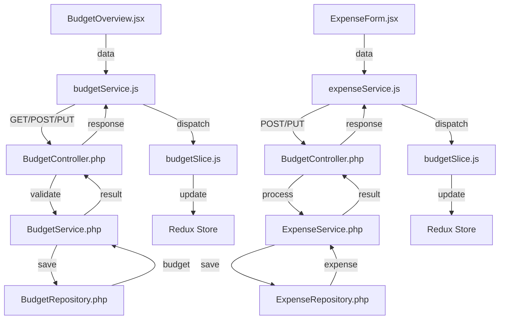

#### Budget-Vendor Integration [✓]
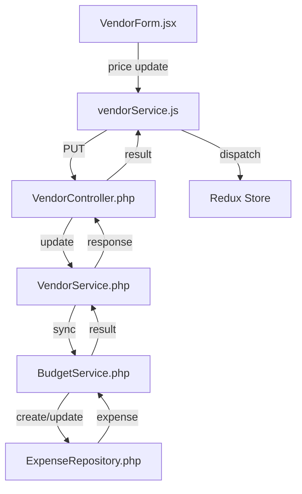

### 10. Photo Gallery Flow [TODO]
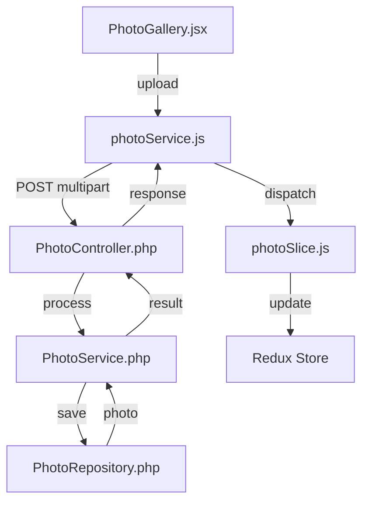

## Error Handling Patterns [✓]

### Frontend Error Boundaries
```javascript
class ErrorBoundary extends React.Component {
    componentDidCatch(error, errorInfo) {
        // Log error to monitoring service
        logError(error, errorInfo);
    }

    render() {
        if (this.state.hasError) {
            return <ErrorFallback />;
        }
        return this.props.children;
    }
}
```

### API Error Handling
```javascript
// Frontend Service
const apiClient = {
    async request(config) {
        try {
            const response = await axios(config);
            return response.data;
        } catch (error) {
            if (error.response?.status === 401) {
                await handleTokenRefresh();
                return this.request(config);
            }
            throw this.normalizeError(error);
        }
    }
};

// Backend Controller
public function handleException($e): JsonResponse
{
    if ($e instanceof ValidationException) {
        return $this->json(['errors' => $e->errors()], 422);
    }
    
    if ($e instanceof AuthenticationException) {
        return $this->json(['error' => 'Unauthorized'], 401);
    }
    
    return $this->json(['error' => 'Server Error'], 500);
}
```

## Testing Strategy [✓]

### Component Tests
1. Unit tests for React components
2. Integration tests for Redux flows
3. API client mocking
4. Error boundary testing
5. Form validation testing

### API Tests
1. Controller endpoint testing
2. Service method testing
3. Repository query testing
4. Authentication flow testing
5. File upload testing

### End-to-End Tests
1. Complete user flows
2. Error scenarios
3. File operations
4. Real API integration
5. Browser compatibility 